# Dental Patient Manager

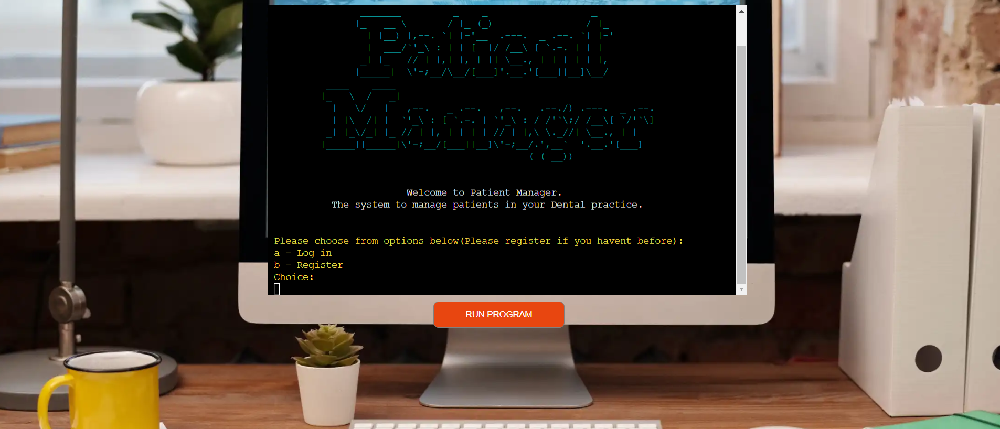

[View Live Link Here](https://patient-manager-system.herokuapp.com/)

# Brief 

This python project is specifically developed for a dental  private practice. 

This is a simple patient management system that would allow users to add, view or edit  appointments, treatments and patient details. 

I decided to build this project for my 3rd portfolio project for code institute having drawn inspiration from my current work life. 

I decided to challenge myself with a trying to complete a command line python application that would allow me to manage patients similarly to the applications used in a real dental private practice. 

# Table of contents
  - [Brief](#brief)
  - [Project](#project)
    - [Scope/ Strategy](#scope-strategy)
    - [Site Owner Goalds](#site-owner-goals)
    - [First time visitor](#first-time-visitor)
    - [Returning visitors](#returning-visitors)
  - [User Experience](#user-experience)
  - [Logic and Features](#logic-and-features)
    - [Python](#python)
    - [Database](#database)
    - [Features](#features)
  - [Future implementation](#features-left-to-implement)
  - [Technologies Used](#technology-used)
    - [Languages Used](langues-used)
    - [Frameworks, Libraries and Programs Used](#frameworks,-libraries-and-programs-used)
    - [Python Libraries](#python-libraries)
  - [Testing](#testing)
    - [Validation](#validation)
    - [Manual Testing](#manual-testing)
  - [Bugs](#bugs)
    - [Solved Bugs](#solved-bugs)
    - [Known Bugs](#known-bugs)
  - [Deployment](#deployment)
    - [Deployment to Heroku](#deployment-to-heroku)
    - [How To Fork](#how-to-fork)
    - [How To Clone](#how-to-clone)
  - [Credits and Acknowledgements](#credits-and-acknowledgements)
    - [Code Used](#code-used)
    - [Content](#content)
    - [Media](#media)
    - [Acknowledgements](#acknowledgements)

# Project 

## Scope/  Strategy

I wanted to develop an application that could be used in real life. In my daily life in the dental environment, i often come across applications to manage patients.I drew inspiration from those applications.
This patient management system allows user to log in, sign in, view patient details, add patient details , add appointments , view appointments , view treatment costs and calculate total payment due. 

The strategy for this project is implemented in the following ways:

* Allows user to enter data which are imported to database.
* Allows user to retrieve data from database.
* Ensure passwords generated are stored in database after being hashed in case of hackers(using bcrypt).
* Ensured all inputs are validated .
* Allows for easy navigation through program .
* Colored texts to display to user depending on user action.
* Database connection with gspread that allows ease of import and export of data.
* Can access all features and user is given option to exit in main menu.

## Site Owner Goals

* Create a system that can be used in a real life dental practice. 
* Ensure a bug free application.
* Ensure that user receives feedback when necessary.
* Decide what type of inputs are valid.

## First time visitor
* As a user, I want to be able to sign in to the program.
* As a user, I want to view a patient's details.
* As a user, I want to add appointments for a patient.
* As a user, I want to add a new patient's details.
* As a user, I want to edit or view treatments. 
* As a user, I want to find the price of treatments.

## Returning visitor
* I want to be able to log in successfully. 
* I don't want to sign up again. 

# User Experience

The outputs displayed to user varies with color in the terminal for better ux. 
For example: 
* For errors and invalid inputs: output message would be red.
* If user has logged in successfully : output message would be green.
* Most other questions or statements are displayed with a shade of yellow.
* If data is being exported from datasheet: The displayed output is a darker yellow

# Logic and Features

## Python flowchart 

A flowchart was created in the start of the project to help build logic for the system.
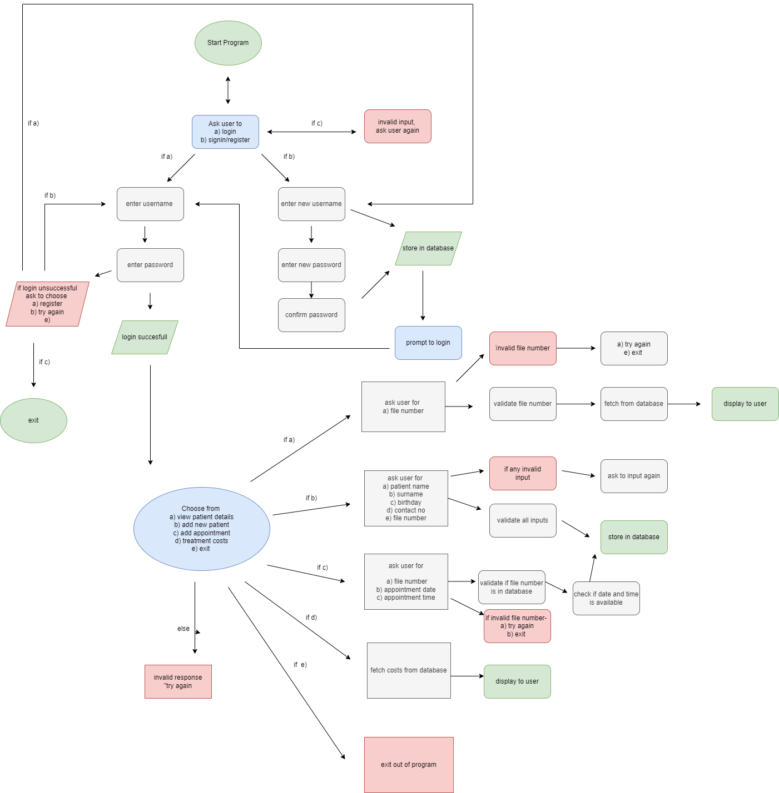

## Datasheet

Google Sheets were used to store data from user into spread sheet and to export data when necessary as well.
This project has a total of 4 worksheets. 

1. The users sheet 

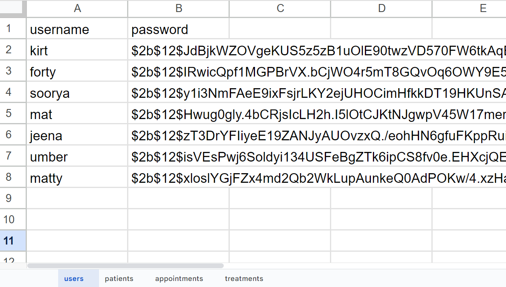

[Link to Users sheet in google sheet](https://docs.google.com/spreadsheets/d/1dkCCupGQAcPjtaDc4UBFdGyKOdK8X6IkiDllRYUHD6U/edit?usp=sharing)
The users sheet contains the user's username and password(hashed with bcrypt). The hashed password is stored in case if the system
is hacked they would not be able to access passwords to log in to the program.
This sheet is user when patient tries signing in/registering to store new username/password and when logging in to check if inputted username and password match the ones in the datasheet.

2. The patients sheet

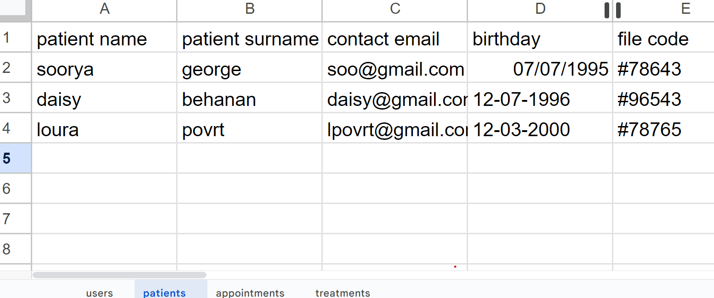

[Link to Patients sheet in google sheet](https://docs.google.com/spreadsheets/d/1dkCCupGQAcPjtaDc4UBFdGyKOdK8X6IkiDllRYUHD6U/edit#gid=1629797953)
The patients sheet contains the patient details of patients. Namely their first name, surname, email address, birthdate and file number.
This sheet is used when viewing patient details and when adding patient details. It is also used to access patient's name when viewing appointments.

3. The appointments sheet

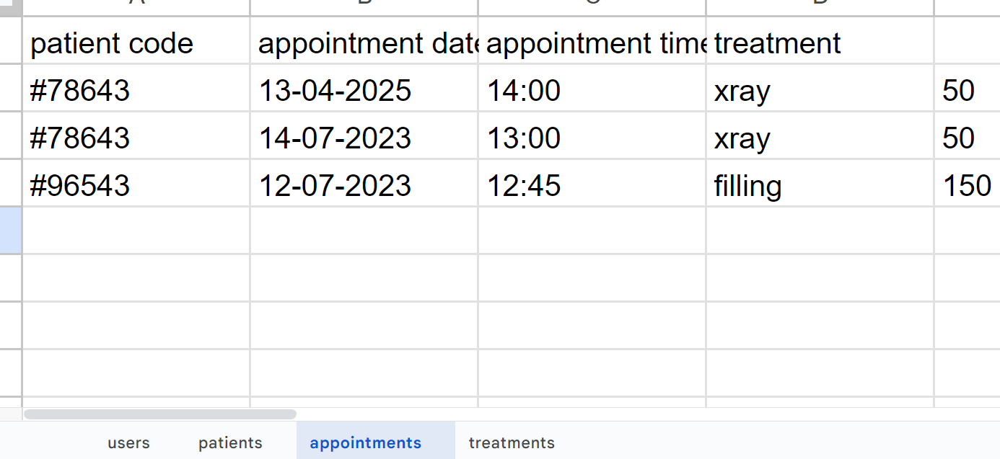

[Link to Appointments sheet in google sheet](https://docs.google.com/spreadsheets/d/1dkCCupGQAcPjtaDc4UBFdGyKOdK8X6IkiDllRYUHD6U/edit#gid=1400056105)
The appointments sheet contains patient file no, appointment date, time, treatment and price.
This sheet is used when adding appointments and viewing appointments. All values in the sheet are entered by user except for the values in the price column. The prices in price column is imported from treatments sheet when user enters patient's treatment for that appointment.

4. The treatments sheet

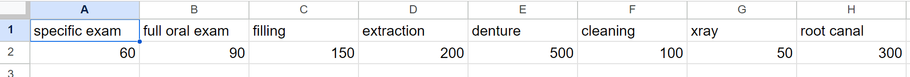

[Link to Treatments sheet in google sheet](https://docs.google.com/spreadsheets/d/1dkCCupGQAcPjtaDc4UBFdGyKOdK8X6IkiDllRYUHD6U/edit#gid=1800076289)
The treatments sheet contains all treatments offered in the dental clinic and the prices for each.
This sheet is accessed when viewing prices, adding treatment prices to show total payment due and to check for treatment prices when adding appointment for a patient. 

## Features

*  MAIN PAGE

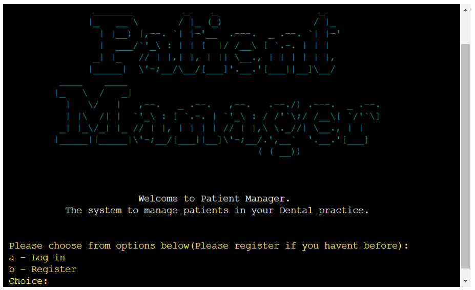

Main page/ Start screen consists of ASCII logo, a welcome message with short description and a menu which allows users to choose between a- log in or b- sign up/register.

If you don't enter a valid option( a or b), then the program will give an error message and will let user choose again.

--- 

* LOG IN

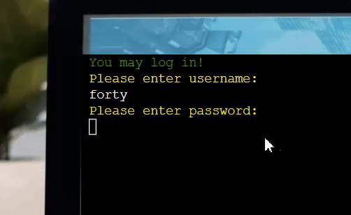

If you choose (a) , The user is allowed to enter username and password.Note that the password entered is invisible. This feature is implemented so noone would be able to see the user's password when typing.

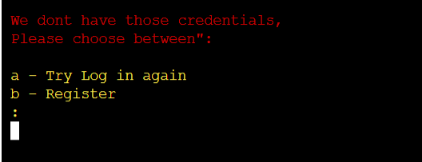

User should only log in if they have already signed up/ registered. If the system doesn't have user's username or password stored in datasheet(Sheet called "users"), it will display this error message and will allow you to choose to register/sign up or log in again.

---

* REGISTER/SIGN UP

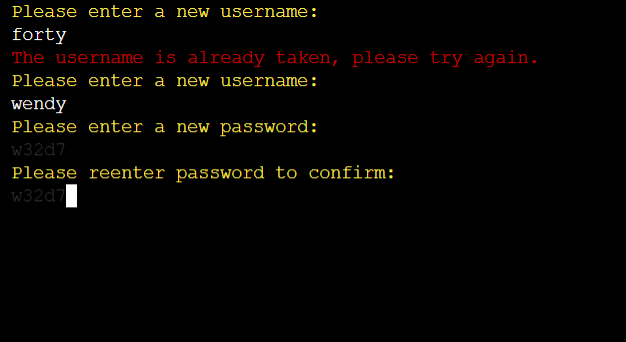

Once you choose to sign up or register, you will be allowed to enter a new username. If the new username inputted is already stored in data sheet users, user will be given an error message and asked to enter another username. Once validated, proceeds to ask for  a new password and then asks user to confirm that password.Note that the passwords entered are in color "Black" to make it almost invisible to prying eyes around.

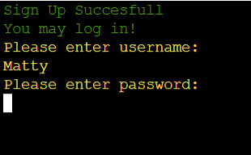

Once you have signed up/registered, the program allows you to log in.

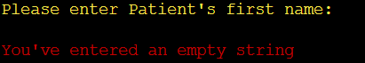

For any string that the system has to store such as a new password, new username, first name(needed to add patient details) and surname (needed to add patient details). The program then makes sure that user does not enter an empty string for those inputs.

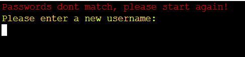

When asked to confirm password, if passwords don't match then user is displayed an error message before asking to start sign up process again.

---

* MAIN MENU

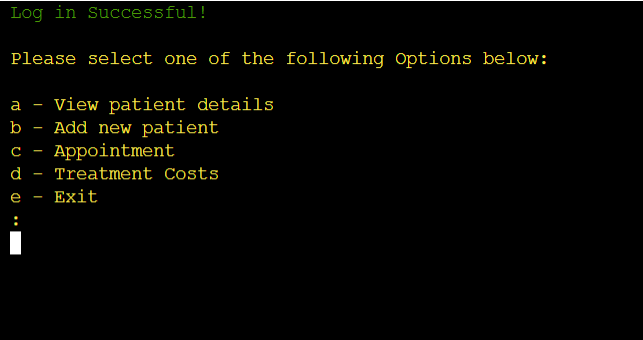

One user logs in successfully, The main menu is displayed which has 5 options(a - e) to choose from.

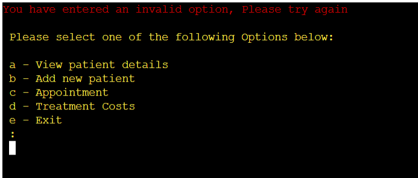

If user doesn't choose an option from (a -b ), then user is displayed an error message before asking to choose again.

* MENU OPTION A

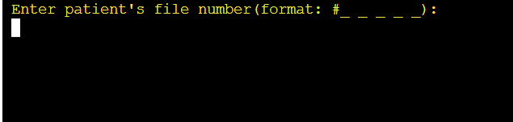

If user chooses option "a", Program asks user to enter a file number(unique code for each patient). 

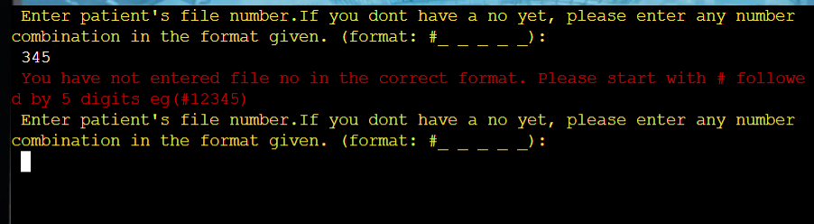

If user doesn't enter a file number with the correct pattern/format, this error will be displayed to user. This error is shown every time user doesn't enter a file number in the correct pattern at any time the user is required to enter a file number in the program. The user is prompt to enter file no again

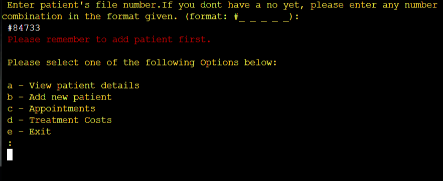

If you enter a file number in the correct pattern/format, but we don't have this patient's details in the patients sheet in google sheet , then user is given this error message and will return user back to main page in order for them to add the patient details of that specific file number.

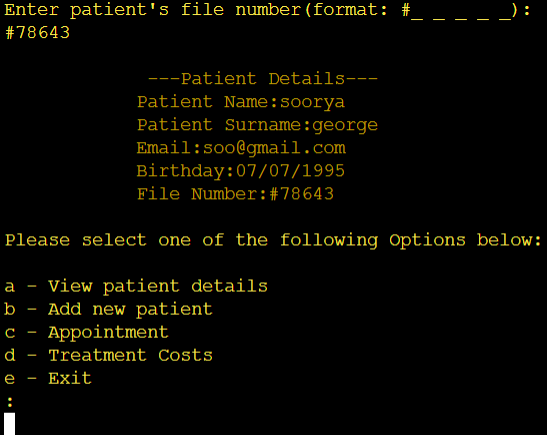

If user does enter a valid file number and it is stored in Patient's sheet in gspread, The program displays the patient's details connected to that specific file number in the terminal. The user  is then returned back to the main menu to be able to choose an option again.

* MENU OPTION B 

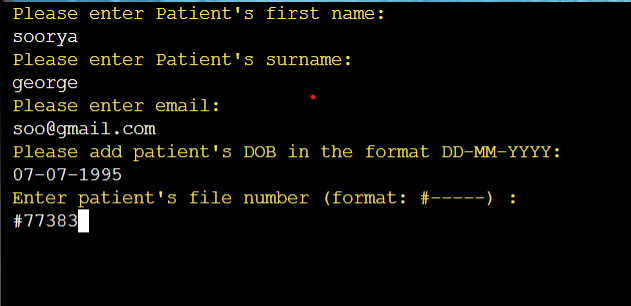

If user chooses option "b" from menu, then user is asked to enter patient's name, surname, birthday, email and file number.
If added successfully, user is returned to the main menu.

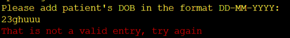

The date entered by user should be in the correct formula, otherwise it will give this error before asking to enter enter date again.

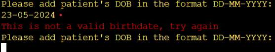

The date entered in the correct formula should be a date in the past, if not then an error message will be displayed before user is asked to enter birthdate again.

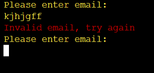

The email entered is validated, if its not in the format of an email. Program will display error message before asking to enter an email again. 

As for the name and surname of patients entered by user , an error message will be displayed if they enter an empty string before requesting to enter the name or surname again.(as shown before in signup/register feature) The file number should also be given in the correct format/pattern in order to be validated. (as shown before in menu a features)

* MENU OPTION C

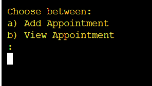

When user chooses menu option "c", the program displays another menu for user to choose. a - To add appointment, or b - to view appointments. 

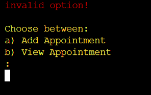

If user chooses neither a or b, an error message is displayed before asking user to choose again.

 * ADD APPOINTMENT 

 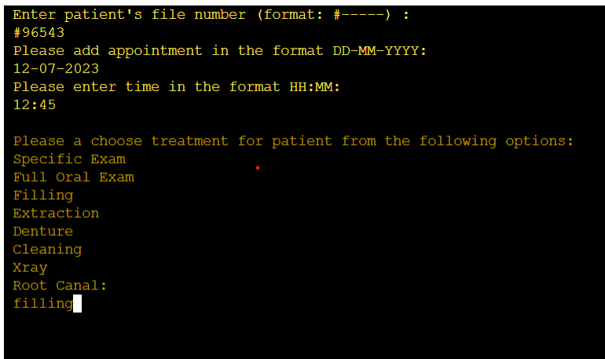

 If user chooses "a", then program proceeds to ask user for patient's file no, appointment date , time and treatment.

 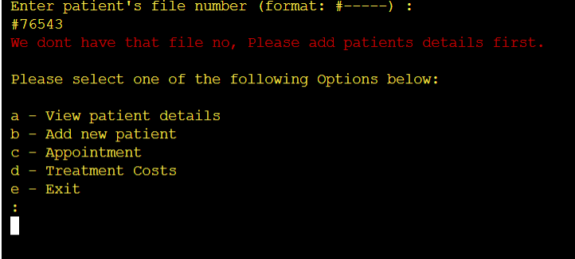

 If user enters a file number that is not stored in the patients sheet in gspread, then user is returned to main menu to add patient's details first. This ensure that patient's details needs to be in the database before you can add an appointment for that patient.

 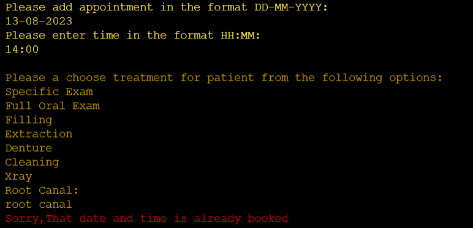

 If user enters a date and time which has already been entered/used in appointment sheet in gspread, then an error message is shown before return user to menu. This ensures that the user cant book more than 1 patient for a specific slot.

 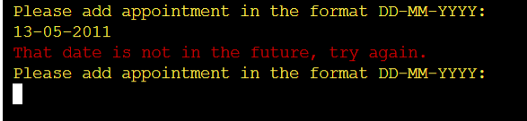

 If user enters a date in the past, this error message will be shown before they are asked to enter appointment date again.
 
 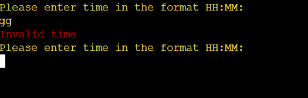

 The time entered should also be written in the correct format or pattern , if not an error is displayed before allowing user to enter time again.

 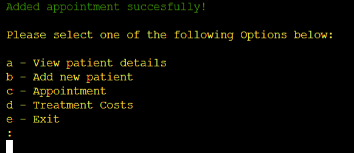

 If appointment is added successfully, a messaged is displayed before returning user to the main menu

 * VIEW APPOINTMENT

 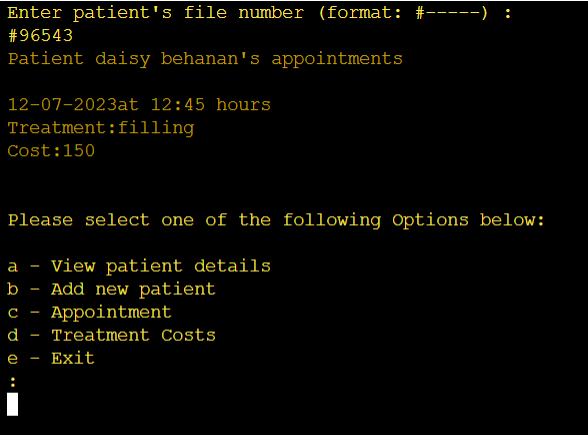

 When user chooses option b- to view appointment, user is prompt to enter patient's file number. The file number is used to retrieve patient's name and surname from patients sheet. The file number is also used to retrieve the appointment details of the patient in the appointment sheets. All appointments made for this particular patient is displayed to user with treatment cost as well.

 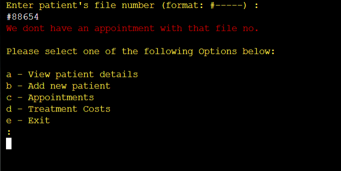

 If user enters a file number that is not in the appointments sheet, the user is displayed this error message before returning user to menu. 

* MENU OPTION D

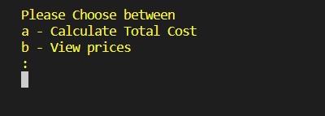

When user chooses menu option d- treatments, program displays another option to user that allows user to calculate total payment due or to view prices.
 
 * PAYMENT DUE 

 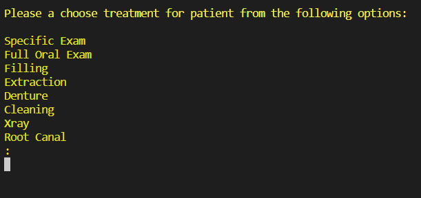

 When user chooses option a - total payment due, the is asked to choose from the treatment options shown. 

 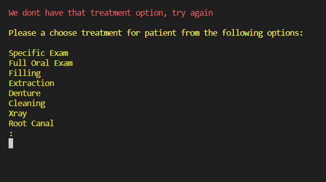

 If user doesn't choose one of the treatment options from the list( doesn't matter if they enter in UPPERCASE or LOWERCASE), an error message is displayed before asking user to enter treatment option again. 

 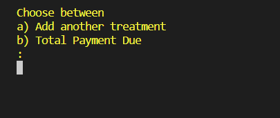

 After user enters a valid treatment option , user is displayed another message which allows them to choose between adding another treatment option or viewing total payment due.
 If user chooses - add another treatment option, then user is displayed the treatment options to choose again.

 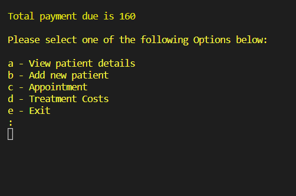

Once user chooses total payment due, then the user is displayed the total cost of all the treatments you have added previously.

 * TREATMENT PRICES

 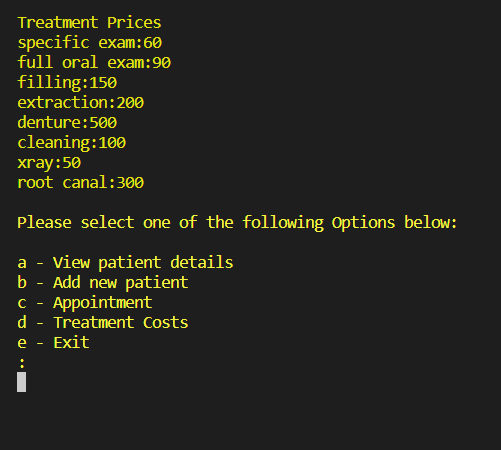

 If user chose to view treatment prices, a list of treatments with their respective prices are shown to the user . These values are exported from the treatments sheet.

* MENU OPTION E
 
 If user chooses menu option "e", the system allows you to return to start screen of the program.

---

## Future implementation 

* I want to add more styling to be able to mimic a real life application.  
* Id want to user to enter more details when adding patient such as address, cell no, etc. 
* An option to say if patient has paid for treatments or not.
* An option to add notes for each patient.
* I'd want to have a search function to be able to search for specific patient incase file number is lost.
* I'd want to be able to print out quotations for each patient and have payment due to be included in.
* Add implementation to include time needed for each appointment 
* Implement a calendar system to mark out days that clinic will not be operating( public holidays)
* Make application to manage patients for more than 1 dentist at a time.
* Include more treatment options

# Technologies Used

## Languages Used

* Python is predominantly used, with the project template having javascript, css and html as well. 
* Markdown is used for the README.md and TESTING.md 

## Frameworks, Libraries and Programs Used

* [GitHub](https://github.com/)- To save and store files.
* [Gitpod](https://gitpod.io/workspaces)- Code editor.
* [Git](https://git-scm.com/) - For Version control.
* [Heroku](https://heroku.com) - For deployment.
* [Google sheets API](https://developers.google.com/sheets/api) - To store and fetch data.
* [Diagrams.net](https://diagram.net) - Used to make flowchart .
* [Pexels](https://www.pexels.com/) - Used for background image.
* [CI Python Linter](https://pep8ci.herokuapp.com/) - To validate python code.
* [Text ASCII Art Generator](http://patorjk.com/software/taag/)  - For start of game logo art piece.

## Python Libraries 

* [gspread](https://docs.gspread.org/)- This is used for control of google sheets API
* [OAuthLib](https://pypi.org/project/oauthlib/)- This is used to authenticate and request HTTP to google sheets API
* [Colorama](https://pypi.org/project/colorama/)- Used to change color of texts displayed in terminal.
* [os](https://docs.python.org/3/library/os.html)- Used to clear terminal when needed
* [re](https://docs.python.org/3/library/re.html)- Used to make pattern for emails, file number to validate input.
* [bcrypt](https://pypi.org/project/bcrypt/)- Used for hashing passwords inputted by user.
* [datetime](https://docs.python.org/3/library/datetime.html)- Used to check inputted date and time format.

# Testing

## Validation

* run.py
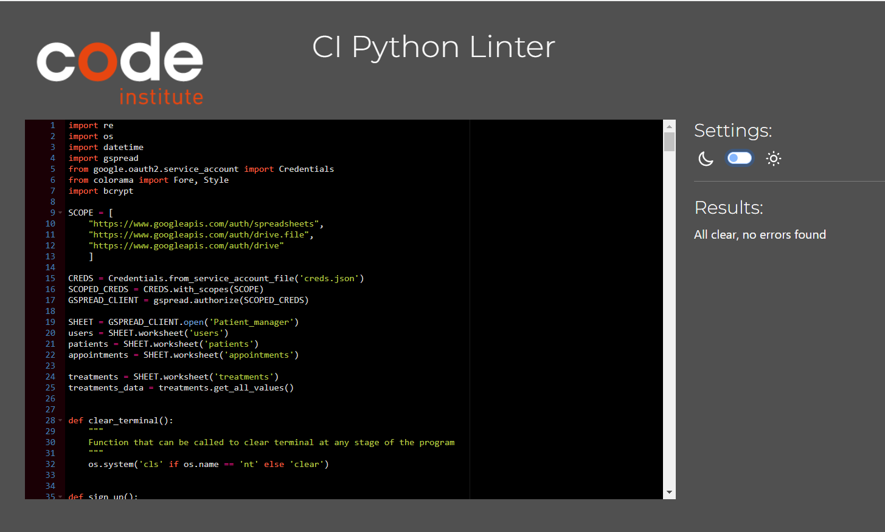

[PEP8CI](https://pep8ci.herokuapp.com/) was used to validate python code. The errors that came up initially were line too long errors, trailing white spaces, blank spaces error which were all corrected

## Manual Testing

Please go over to [TESTING.md](TESTING.md) for manual testing documentation.

# Bugs 

## Solved Bugs

| Bug | Solution | 
| --- | --- |
| 1.	Was unable to store hashed passwords, gave error-Type Error: Object of type bytes is not JSON serializable. when trying to store my hashed password to gspread | This was solved by decoding the byte object to store the password as string. I found solution here https://stackoverflow.com/questions/44682018/typeerror-object-of-type-bytes-is-not-json-serializable |
| 2. When user chose option to view appointments for a certain patient,	The system was only showing one appointment for patient and not all appointments assigned to that patient. | I solved this by using for loop in view_appointment() to check the column in appointment sheet that has all the file numbers. I then used if statement to check if inputted file number corresponded to file numbers stored in the appointment sheet's file number column. If they are the same, then for loop will allow all the appointments with that specific file number to be displayed to user. In the data sheet below you can see appointments for same file number. 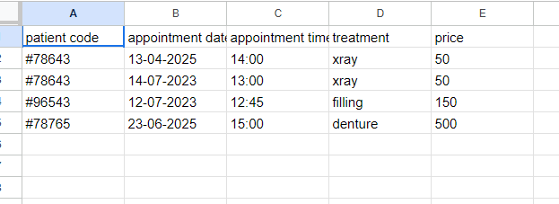,  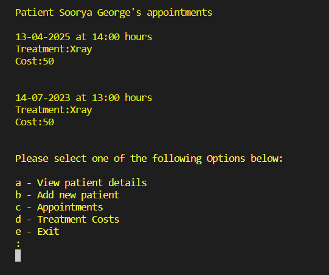 This will then be displayed as this to user|
| 3.	I realized after finishing 90% of the application that when i log in and i don't have the correct credentials then user is at a dead end. and is not given an option to sign up or try again.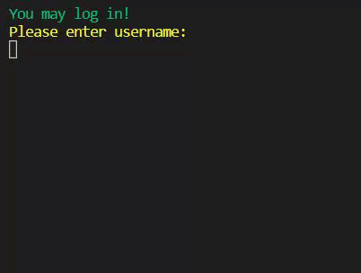 | This was solved by giving user option to try again or sign up to store their credentials. 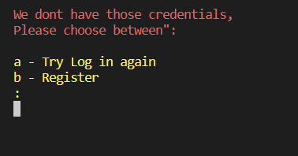 |
| 4.	Appointments could be made for file numbers who didn't have patient details yet. This would then cause problems when user checks for patient details of an appointment that is made as there would be none| This is solved by first checking if file number entered by user to make appointment was in the patients sheet first, if that specific file number is already stored in the patients sheet then program proceeds to ask user to enter appointment date and time to make a booking. However, If inputted file number does not correspond to a file number in patient's sheet then user will be redirected to the main menu to enter patient's details before making an appointment. For example: user enters file no #78653 to make appointment and the app will check through patients sheet file number column 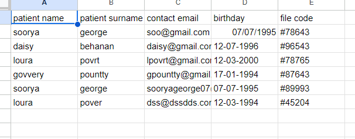 . As you can see that specific file number is in patient sheet file number column, and will then proceed to ask user with the necessary questions to make appointment. If that file number is not found in patient's sheet file number column, user will be redirected like so -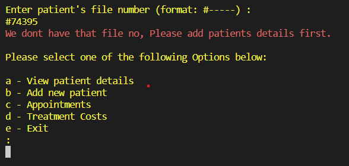 |
| 5.	When user tried to view appointments for which patient details are already added, User is asked to input patient's file number. This gave error because appointment was not yet made with the specific patient yet . | Solved by using for loop to check if inputted file number was in appointment sheet in database/gspread and if it wasn't there then user is returned back to menu.  |
| 6.	When user wanted to add patient details, they could add the same file number more than once in patients datasheet. This should cause problems as file number should be unique to each patient | This was solved by by checking the inputted file number with the file numbers stored in patient details using for loop. If it is already stored, error message will be displayed before user is returned back to main menu.  |
| 7.	User were able to store empty strings as values in data base when adding patient details or storing usernames and passwords | This is solved by passing inputs into function not_empty() to make sure the length of their string is not 0, If it is 0, then user is prompted with message "You've entered an empty value" before being prompted to ask for the input again. |
| 8.	User was able to enter same appointment and time for multiple patients. This would not work in real life as there can only be 1 patient booked for one slot. |  I created an is_available() method in class scheduler to pass arguments date and time which is inputted by user. This date and time is checked with the appointments sheet's stored date and time . If both of these values correspond to a patient, then error message is shown to user saying "Sorry, that slot is already booked" before returning patient to menu. |

## Known Bugs

# Deployment 

## Deployment to Heroku

The site was deployed to heroku with the following steps: 

1. Type in pip3 freeze > requirements.txt in terminal to add to requirements.txt
2. Git add, git commit and push changes.
3. Visit [Heroku](https://id.heroku.com/login) to create an account. 
4. Click on "Create new app".
5. I entered my app name as "patient-manager-system"
6. Enter region as Europe.
7. Click on Create App Button.
8. The new page contains several tabs. Select settings tab first. 
9. Scroll down in settings tab to Section "Config Vars"
10. Click button "Reveal Config Vars"
11. Go back to gitpod and copy creds.json contents
12. In the KEY field under Config Vars ,Enter "CREDS" (NB:UPPERCASE)
13. In the value field under config Vars, paste contents of creds.json.
14. Click button "Add"
15. Add another KEY - "PORT"
16. Add another VALUE - "8000"
17. Click button "Add" again.
18. Scroll down to "Build Packs" section, and click on "Add Build Pack"
19. In the pop up window, click on "Python" and then "Save Changes"
20. click on "Add Build Pack" again and click on "node.js" and then "Save Changes" again
21. The buildpacks should be in the order of "Python" on top, and "node.js" underneath.
22. Scroll up, and then click on the "Deploy" Tab.
23. Scroll down and go to section "Deployment Method", select "Git Hub"
24. Confirm that you want to connect to Github below .
25. Once connected, Type in the name of repository ( This project - Patient-Manager) and click on "Search"
26. Once the "Patient-Manager" repository is found, click on connect.
27. Once connected, scroll down to automatic deploy. Click on "Enable Automatic Deploys"
28. Afterwards, click on "Deploy Branch" . 
29. Once you see the message "the app was successfully deployed", then the app link will be provided to you.
29. You can click on that to view deployed heroku terminal.
30. I added Coloroma, and Bcrypt after deploying which needed to be added to requirements.txt using pip3 freeze > requirements.txt in order for them to operate on the deployed heroku terminal.

## How To Fork

To fork the Patient-Manager Repository:

Log in or Sign up to github.
Find the repository for this project, SooryaGeorge7/Patient-Manager
Click the fork button on top right corner.
How to Clone

## How To Clone

To clone the Patient-Manager Repository:

Log in or Sign up to github.
Find the repository for this project, SooryaGeorge7/Patient-Manager.
Click on Code button just left to the green gitpod button.
Select what you would like to clone with (HTTPS/SSH/GitHub CLI) and copy the link shown below.
Open the terminal in your code editor(eg. Gitpod) and change the current working directory to the location you want to use for cloned directory.
In the terminal type in "git clone" and paste the link you copied in step 4 above. Press enter.
Cloning is now completed.

# Credits and Acknowledgements

## Code Used

* Learnt how to clear terminal here - https://stackoverflow.com/questions/2084508/clear-terminal-in-python
* Learnt how to use coloroma here - https://linuxhint.com/colorama-python/
* Learnt how to hash passwords here - https://stackoverflow.com/questions/63387149/hashing-a-password-with-bcrypt, https://www.youtube.com/watch?v=hNa05wr0DSA&t=679s
* Learnt how to use regular expressions here - https://www.geeksforgeeks.org/pattern-matching-python-regex/
* Learnt how to use datetime here - https://stackoverflow.com/questions/16870663/how-do-i-validate-a-date-string-format-in-python, https://stackoverflow.com/questions/33076617/how-to-validate-time-format

## Content 

* All content for application is written by me 

## Media

[Pexels.com](https://www.pexels.com)- Used to get background image for deployed terminal

## Acknowledgements

* I want to thank code institute slack #project-portfolio-3 group for all valuable knowledge I've learnt in short space of time
* I want to thank my mentor Brian O'hare for the support and encouragements.
* I acknowledge the tutor support for helping me understand some concepts with regards to git and heroku. 
* I acknowledge UCD novemeber 2022 private group for the support among fellow peers.
* I want to thank Chris Quinn for delivering out masterclasses and facilitator sessions for python essentials.

## Disclaimer

* This app is made for project portfolio 3 with full stack development course with Code institute and is made for educational purposes only.
