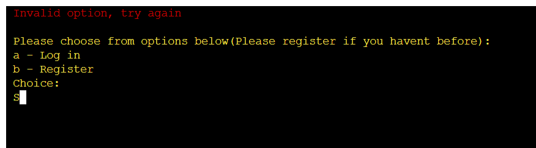

# Dental Patient Manager

## Brief 

This python project is specifically developed for a dental or medical private practice. 

This is a simple patient management system that would allow users(eg. admin) to add, view or edit  appointments, treatments and patient details. 

I decided to build this project for my 3rd portfolio project for code instutute having drawn inspiration from my current work life. 

I decided to challenge myself with a trying to complete a command line python application that would allow me to manage patients similarly to the applications used in real dental private practices. 

## Table of contents
  - [Brief](#brief)
  - [User Stories](#user-stories)
    - [First time visitor](#first-time-visitor)
    - [Returning visitors](#returning-visitors)
  - [Logic and Features](#logic-and-features)
    - [Python](#python)
    - [Database](#database)
    - [Features](#features)
  - [Future implementation](#features-left-to-implement)
  - [Technologies Used](#technology-used)
    - [Languages Used](langues-used)
    - [Frameworks, Libraries and Programs Used](#frameworks,-libraries-and-programs-used)
  - [Testing](#testing)
  - [Bugs](#bugs)
    - [Solved Bugs](#solved-bugs)
    - [Known Bugs](#known-bugs)
  - [Deployment](#deployment)
    - [Deployment to Heroku](#deployment-to-heroku)
    - [How To Fork](#how-to-fork)
    - [How To Clone](#how-to-clone)
  - [Credits and Acknowledgements](#credits-and-acknowledgements)
    - [Code Used](#code-used)
    - [Content](#content)
    - [Media](#media)
    - [Acknowledgements](#acknowledgements)

## User Stories 

### First time visitor
* I want to be able to sign in to the program.
* I want to view patient's details 
* I want to add appointments for a patient.
* I want to edit or view treatments. 
* I want to find the price of treatments.

### Returning visitor
* I want to be able to log in succesfully. 
* I dont want to sign up again. 

# Logic and Features

## Python flowchart 

A flowchart was created in the start of the project to help build logic for the system.

## DataSheet

Google Sheets were used to store data from user into spread sheet and to export data when neccessary as well.
This project has a total of 4 worksheets. 

1. The users sheet 

The users sheet contains the user's username and password(hashed with bcrypt). The hashed password is stored in case if the system
is hacked they would not be able to access passwords to log in to the program.
This sheet is user when patient tries signing in/registering to store new username/password and when loging in to check if inputed username and password match the ones in the datasheet.

2. The patients sheet

The patients sheet contains the patient details of patients. Namely their first name, surname, email address, birthdate and file number.
This sheet is used when viewing patient details and when adding patient details.It is also used to access patient's name when viewing appointments.

3. The appointments sheet

The appointments sheet contains patient file no, appointment date, time, treatment and price.
This sheet is used when adding appointments and viewing appointments. All values in the sheet are entered by user except for the values in the price column.The prices in price column is imported from treatments sheet when user enter's patient's treatment for that appointment.

4. The treatments sheet

The treatments sheet contains all treatments offered in the dental clinic and the prices for each.
This sheet is accessed when viewing prices,adding treatment prices to show total payment due and to check for treatment prices when adding appointment for a patient. 

## Features

*  MAIN PAGE

Main page/ Start screen consists of ASCII logo, welcome message with short description and a menu to choose between log in or sign up.

If you dont enter a valid option( a or b), then program will give error message and then will let user choose again.

--- 

* LOG IN

Once you choose (a) , The user is allowed to enter username and password.

User should only log in if they have already signed up/ registered.If the system does'nt have your username or password in datasheet, it will display this error message and will allow you to choose to sign up or log in again.

---

* REGISTER/SIGN UP

Once you choose to sign up or register, you will be allowed to enter a new username. If the same username is already stored in data sheet users, user will be given an error message and asked to enter another user name. Once validated, proceeds to ask for  a new password and then to confirm that password.

Once you have signed in, program allows you to log in.

For any string that the system has to store such as new password, new username, first name(needed to add patient details) and surname (needed to add patient details). The program then makes sure that user does not enter an empty string for those inputs.

When asked to confirm password, if passwords dont match then user is displayed an error message before asking to start again.

---

* MAIN MENU

One user logs in successfully, The main menu is displayed which has 5 options(a - e) to choose from.

If user doesnt choose an option from (a -b ), then user is displayed an error message before asking to choose again.

* MENU OPTION A

If user chooses option "a", Program asks user to enter a file number(unique code for each patient). 

The file number has a specific unque pattern, if user doesnt enter a file number with the correct pattern/format, it will give off this error. This error is shown everytime user doesnt enter a file number in the correct pattern at any time the user is required to enter a file number in the program. 

If you enter a file number in the correct pattern/format, but we dont have this patient's details in the patients sheet , then user is given error message and will return user back to main page inorder for them to add the patient details of that specific file number.

If user does enter a valid file number and it is stored in Patient's sheet in gspread, The program exports/ returns the patient's details connected to that specific file number.The user then is returned back to the main menu to be able to choose an option again.

* MENU OPTION B 

* MENU OPTION C

 * ADD APPOINTMENT 

 
 
 
 
 

 * VIEW APPOINTMENT

 
 

* MENU OPTION D

 
 * PAYMENT DUE 

 
 
 
 

 * TREATMENT PRICES

 

## Future implementation 
* I want to add css styling to be able to mimick a real life application.  
* Id want to give user more options such as adding and calculating treatments for each patient. 
* An option to say if patient has paid for treatments or not.
* An option to add notes for each patient.
* Add much more details for patients information( taking in address etc)

## Technologies Used

### Languages Used

* Python is predominently used, with the project template having javascript and html as well. 
### Frameworks, Libraries and Programs Used

* [GitHub](https://github.com/)- To save and store files
* [Gitpod](https://gitpod.io/workspaces)- Code editor
* [Git](https://git-scm.com/) - For Version control
* [Heroku](https://heroku.com) - For deployment
* [Google sheets API](https://developers.google.com/sheets/api) - To store and fetch data
* [Diagrams.net](https://diagram.net) - Used to make flowchart 
* [CI Python Linter](https://pep8ci.herokuapp.com/) - To validate code
* [Ascii Art](https://www.asciiart.eu/) - For start of game art piece 
## Testing

## Bugs 
### Solved Bugs
### Known Bugs

## Deployment 
### Deployment to Heroku

### How To Fork

To fork the Patient-Manager Repository:

Log in or Sign up to github.
Find the repository for this project, SooryaGeorge7/Patient-Manager
Click the fork button on top right corner.
How to Clone

### How To Clone

To clone the Patient-Manager Repository:

Log in or Sign up to github.
Find the repository for this project, SooryaGeorge7/Patient-Manager.
Click on Code button just left to the green gitpod button.
Select what you would like to clone with (HTTPS/SSH/GitHub CLI) and copy the link shown below.
Open the terminal in your code editor(eg. Gitpod) and change the current working directory to the location you want to use for cloned directory.
In the terminal type in "git clone" and paste the link you copied in step 4 above. Press enter.
Cloning is now completed.

## Credits and Acknowledgements

### Code Used
### Content 
### Media
### Acknowledgements
